<div align="center">
  
</div>

# ING. EN REDES INTELIGENTES Y CIBERSEGURIDAD

---
## INSTRUMENTO DE EVALUACIÓN
## Automatización de Infraestructura Digital I
## Unidad I. Entornos de desarrollo en la automatización de redes

**Nombre del Alumno:** KEVIN JESÚS TREJO MIRELES 1223100460

**Grupo:** GIRI6091-e

**Fecha:** 01/06/2026  

**Profesor:** Eric Domenzain Morales

---

---
# Índice

1. [**Actividad 1**](#actividad-1)
   - [Introducción](#introducción)
   - [Desarrollo](#desarrollo)
     - [Descripción de las herramientas utilizadas para automatización](#descripción-de-las-herramientas-utilizadas-para-automatización)
       - [Docker Engine](#docker-engine)
       - [Docker Compose](#docker-compose)
       - [Docker Swagger](#docker-swagger)
     - [Procedimiento de instalación](#Procedimiento-de-instalación)
       - [Instalación técnica de herramientas necesarias](#instalacion-herramientas)
       - [Instalación técnica de docker](#instalacion-docker)
       - [Instalación técnica de Git](#instalacion-git)
     - [Evidencia de pruebas de verificación de funcionamiento](#Evidencia-de-pruebas-de-verificación-de-funcionamiento)
       - [Ejecutar la imagen “hello-world” para verificar el funcionamiento de docker](#Ejecutar-la-imagen-“hello-world”-para-verificar-el-funcionamiento-de-docker)
       - [Ejecutar un archivo “.YML” para verificar el funcionamiento de contenedores](#Ejecutar-un-archivo-“.YML”-para-verificar-el-funcionamiento-de-contenedores)
   - [Conclusión](#conclusión)


2. [**Actividad 2**](#actividad-1)
   - [Configuración de una aplicación](#introducción)
        - [Crear archivo YML](#crear-un-archivo-yml-con-el-siguiente-nombre-stack-iniciales-alumno.yml)
        - [Servicio PhpMyAdmin](#agregar-servicio-phpmyadmin)
        - [Servicio MySQL](#agregar-servicio-mysql)
        - [Dockerfile Backend](#crear-el-archivo-dockerfile-para-configurar-el-servicio-backend)
        - [Contenedor Backend](#construir-contenedor-backend)
        - [Dockerfile Frontend](#crear-el-archivo-dockerfile-para-configurar-el-servicio-frontend)
        - [Contenedor Frontend](#construir-contenedor-frontend)
        - [Resultados Esperados](#resultados-esperados)
   - [Bibliografía](#Bibliografía)


---
---
---

# Actividad 1
## Introducción
El presente reporte documenta el proceso de instalación, configuración y verificación de las principales herramientas utilizadas en el ámbito de la automatización de redes y el despliegue de aplicaciones mediante contenedores. En el contexto actual del desarrollo de software y la administración de infraestructuras, la capacidad de automatizar procesos se ha convertido en una habilidad fundamental para cualquier profesional del área de tecnologías de la información.Durante el desarrollo de esta práctica se trabajó con herramientas ampliamente adoptadas en la industria, entre las que destacan Docker Engine, Docker Compose y Git, las cuales permiten crear entornos de desarrollo reproducibles, portables y fácilmente escalables. 

Estas tecnologías forman parte del ecosistema DevOps, un enfoque que busca integrar el desarrollo de software con la operación de sistemas de manera eficiente y continua.El uso de contenedores representa una evolución significativa respecto a las máquinas virtuales tradicionales, ya que permiten empaquetar una aplicación junto con todas sus dependencias en una unidad ligera y autónoma que puede ejecutarse de manera consistente en cualquier entorno, independientemente del sistema operativo subyacente. Esto elimina el clásico problema de "en mi máquina sí funciona", garantizando que el comportamiento de la aplicación sea idéntico en desarrollo, pruebas y producción.

A lo largo de este reporte se describen las herramientas utilizadas, el procedimiento detallado de instalación, las evidencias de verificación del funcionamiento del entorno y las conclusiones obtenidas durante el proceso.

---

## Desarrollo

### Descripción de las herramientas utilizadas para automatización:
#### ■​ Docker Engine.
Docker Engine es el motor principal de la plataforma Docker, responsable de crear, ejecutar y gestionar contenedores. Funciona como un servicio en segundo plano (daemon) que recibe instrucciones a través de una interfaz de línea de comandos (CLI) o una API REST. Docker Engine utiliza características del kernel de Linux como namespaces y cgroups para aislar los procesos dentro de los contenedores, garantizando que cada contenedor tenga su propio sistema de archivos, red y espacio de procesos independiente del sistema anfitrión.
A diferencia de las máquinas virtuales, los contenedores no requieren un sistema operativo completo, lo que los hace significativamente más ligeros y rápidos de iniciar. Docker Engine es compatible con sistemas operativos Linux, Windows y macOS, y es la base sobre la cual se construyen todas las demás herramientas del ecosistema Docker.

#### ■​ Docker Compose.
Docker Compose es una herramienta que permite definir y gestionar aplicaciones multi-contenedor mediante un archivo de configuración en formato YAML (.yml). En lugar de ejecutar cada contenedor de forma individual con comandos largos y complejos, Docker Compose permite describir todos los servicios, redes y volúmenes de una aplicación en un solo archivo y levantarlos con un único comando.
Es especialmente útil en entornos de desarrollo donde una aplicación depende de múltiples servicios, como una base de datos, un servidor web y una API backend. Docker Compose gestiona automáticamente las dependencias entre servicios, asegurando que se inicien en el orden correcto.

#### ■​ Docker Swagger.
Swagger (actualmente conocido como OpenAPI) es una especificación y un conjunto de herramientas para diseñar, construir, documentar y consumir APIs REST. En el contexto de Docker, Swagger puede desplegarse como un contenedor que proporciona una interfaz gráfica interactiva donde los desarrolladores pueden visualizar y probar los endpoints de una API sin necesidad de herramientas externas como Postman. Esto facilita la colaboración entre equipos de desarrollo y permite una documentación siempre actualizada y accesible.

### Procedimiento de instalación:
#### ■​ Instalación técnica de herramientas necesarias (VSCode, Plugins, etc.).
Instalación de VSCode y Plugins
Visual Studio Code es el editor de código recomendado para el desarrollo con Docker y Node.js. Para instalarlo en Ubuntu:

```shell3
sudo apt-get update
sudo apt-get install wget gpg -y
wget -qO- https://packages.microsoft.com/keys/microsoft.asc | gpg --dearmor > packages.microsoft.gpg
sudo install -o root -g root -m 644 packages.microsoft.gpg /etc/apt/trusted.gpg.d/
sudo sh -c 'echo "deb [arch=amd64] https://packages.microsoft.com/repos/vscode stable main" > /etc/apt/sources.list.d/vscode.list'
sudo apt-get update
sudo apt-get install code -y 
```

Los plugins recomendados dentro de VSCode son:

- Docker (Microsoft) ➡  gestión de contenedores desde el editor
- Remote - SSH ➡  conexión a servidores remotos
- GitLens ➡ visualización del historial de Git
- YAML ➡ soporte para archivos .yml

#### ■​ Instalación técnica de docker.
```shell3
sudo apt-get update
sudo apt-get install docker.io -y
sudo apt-get install docker-compose -y
```
Verificar instalación:
```shell3
docker --version
docker-compose --version
```
Agregar usuario al grupo docker (para no usar sudo):
```shell3
sudo usermod -aG docker $USER
newgrp docker
```

#### ■​ Instalación técnica de Git.
```shell3
sudo apt-get update
sudo apt-get install git -y
git --version
```
Configuración inicial:
```shell3
git config --global user.name "Tu Nombre"
git config --global user.email "tu@email.com"
```

### Evidencia de pruebas de verificación de funcionamiento:
#### ■​ Ejecutar la imagen “hello-world” para verificar el funcionamiento de docker.
Para verificar que Docker Engine está correctamente instalado y funcionando:
```shell3
sudo docker run hello-world
```
Salida esperada:
<div align="center">
  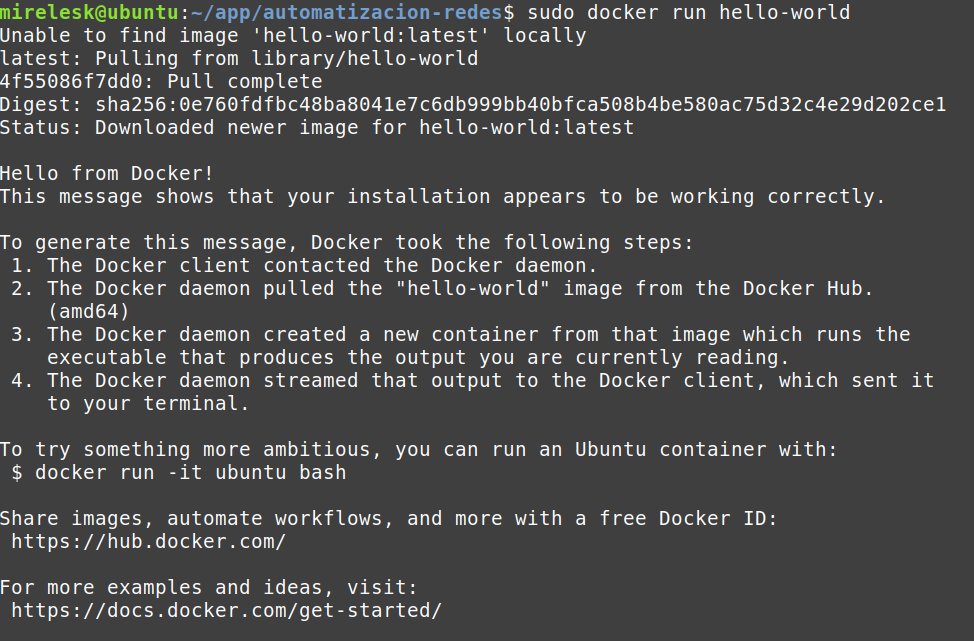
</div>

#### ■​ Ejecutar un archivo “.YML” para verificar el funcionamiento de contenedores.
Se utilizó el archivo stack-kjtm.yml con la configuración de 4 servicios: MySQL, PhpMyAdmin, Backend Node.js y Frontend Angular. El comando para levantar todos los servicios fue:
```shell3
sudo docker-compose -f stack-kjtm.yml up --build -d
```
Verificación del estado de los contenedores:
```shell3
sudo docker-compose -f stack-kjtm.yml ps
```
Resultado:
<div align="center">
  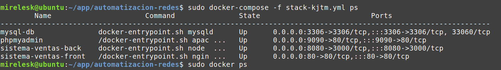
</div>

Los 4 servicios se encontraban en estado Up, confirmando el correcto funcionamiento del entorno.

## Conclusión
A lo largo de esta práctica se logró instalar y configurar de manera exitosa el entorno de desarrollo basado en contenedores Docker. Se comprendió la importancia de Docker Engine como motor de contenedores, Docker Compose como herramienta de orquestación multi-servicio y Git como sistema de control de versiones.
El proceso permitió desplegar una aplicación completa formada por cuatro servicios independientes (frontend Angular, backend Node.js, base de datos MySQL y administrador PhpMyAdmin), todos comunicándose entre sí dentro de una red de contenedores. Se identificaron y resolvieron problemas reales durante el proceso, como incompatibilidades de autenticación en MySQL 8, conflictos de CORS en el navegador y errores de versión de Node.js, lo que enriqueció significativamente el aprendizaje práctico.
Se concluye que el uso de contenedores facilita enormemente la portabilidad y reproducibilidad de los entornos de desarrollo, eliminando problemas de compatibilidad entre sistemas y agilizando el proceso de despliegue de aplicaciones en cualquier infraestructura.

# Actividad 2
## Configuración de una aplicación
### ●​ A partir de los siguientes recursos (https://github.com/edomenzain/automatizacion-redes) realizar lo siguiente:

### ●​ Crear un archivo YML con el siguiente nombre: stack-iniciales-alumno.yml

<div align="center">
  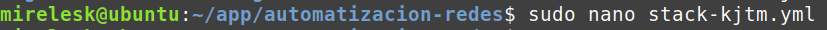
</div>


### ●​ Agregar y mostrar el proceso de la creación del servicio de PhpMyAdmin utilizando la imagen oficial de Docker Hub (https://hub.docker.com/) de acuerdo a la siguiente configuración:
<div align="center">
  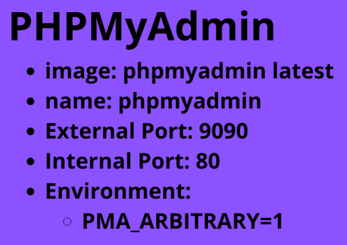
</div>

Prueba:
<div align="center">
  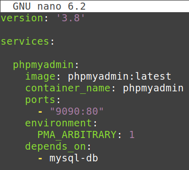
</div>

### ● Agregar y mostrar el proceso de la creación del servicio de MySql Server utilizando la imagen oficial devDocker Hub (https://hub.docker.com/) de acuerdo a la siguiente configuración:

<div align="center">
  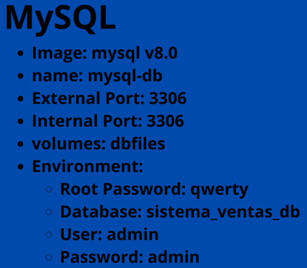
</div>
Prueba: 
<div align="center">
  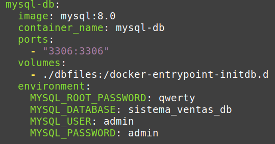
</div>

### ●​ Crear el archivo Dockerfile para configurar el servicio backend:
<div align="center">
  
</div>
○​ Usar la versión de node 18.17.1-alpine

○​ Crear un directorio en /usr/src/app

○​ Copiar los archivos package.json y package-lock.json al directorio raíz ./

○​ Instalar las dependencias: Ejecutar el comando npm install

○​ Copiar todo el directorio del proyecto al contenedor.

○​ Exponer el puerto 3000

○​ Agregar el comando CMD [“node”, “index.js”]

Prueba: 
<div align="center">
  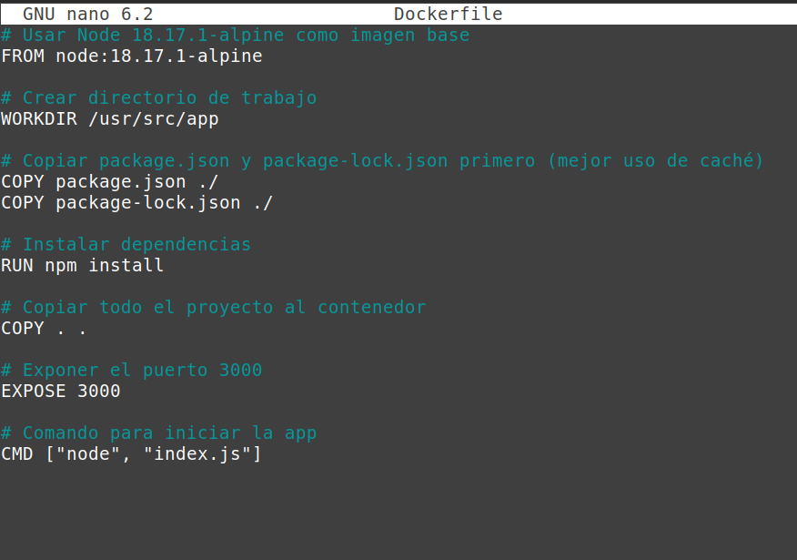
</div>

### ●​ A partir del archivo Dockerfile creado para el backend se debe construir el contenedor de acuerdo a la siguiente configuración:
<div align="center">
  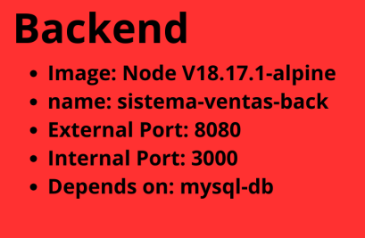
</div>

Prueba: 
<div align="center">
  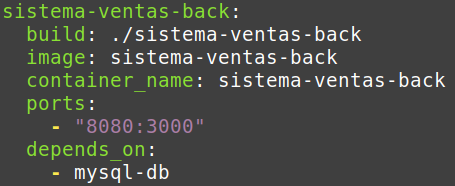
</div>


### ●​ Crear el archivo Dockerfile para configurar el servicio frontend
<div align="center">
  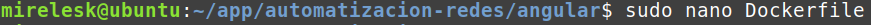
</div>
○​ Usar la versión de nginx:stable-alpine.

○​ Crear un volumen con el nombre /temp

○​ Eliminar de la imagen el contenido de la carpeta /usr/share/nginx/html/*

○​ Copiar el contenido de la configuración de nginx.conf, mime.types y el directorio sistema-ventas-front a sus respectivas carpetas.

○​ Exponer el puerto 80.

○​ Ejecutar el comando: CMD[“nginx”, “-g”, “daemon off;”]

Prueba:
<div align="center">
  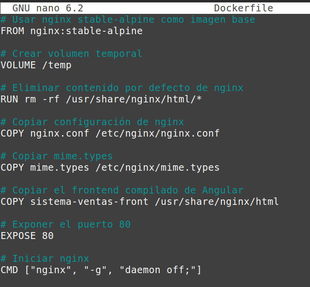
</div>

### ● A partir del archivo Dockerfile creado para el frontend se debe construir el contenedor de acuerdo a la siguiente configuración:
<div align="center">
  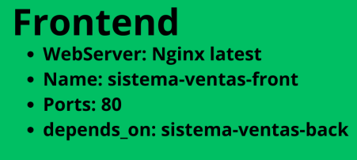
</div>
Prueba:
<div align="center">
  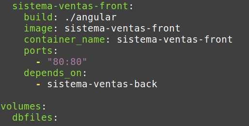
</div>

## RESULTADOS ESPERADOS:
### Frontend:

●​ usuario: admin

●​ Contraseña: 12345678

<div align="center">
  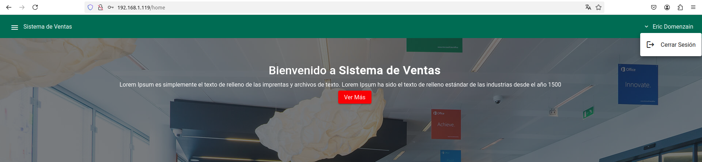
</div>

### Backend:
<div align="center">
  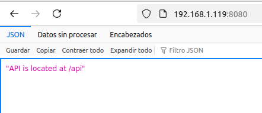
</div>

### PhpMyAdmin
●​ servidor: mysql-db

●​ usuario: admin

●​ Contraseña: admin
<div align="center">
  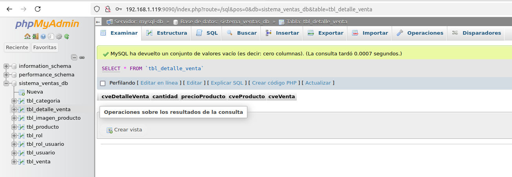
</div>

## Bibliografía

Chacon, S., & Straub, B. (2014). *Pro Git* (2nd ed.). Apress. 
https://git-scm.com/book/en/v2

Docker Inc. (2024). *Docker Engine overview*. Docker Documentation. 
https://docs.docker.com/engine/

Docker Inc. (2024). *Docker Compose overview*. Docker Documentation. 
https://docs.docker.com/compose/

Docker Inc. (2024). *Docker Hub*. 
https://hub.docker.com/

Linux Foundation. (2024). *Git reference manual*. 
https://git-scm.com/docs

Microsoft. (2024). *Visual Studio Code documentation*. 
https://code.visualstudio.com/docs

OpenAPI Initiative. (2024). *OpenAPI Specification*. 
https://spec.openapis.org/oas/latest.html

SmartBear Software. (2024). *Swagger documentation*. 
https://swagger.io/docs/